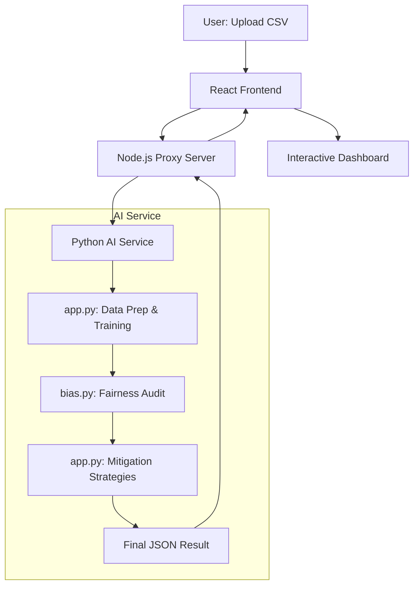
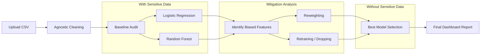

# Bias-Detect Auditor: Technical Documentation

## Overview
The Bias-Detect Auditor is a full-stack platform developed to identify, analyze, and mitigate algorithmic bias within machine learning datasets. The system provides an automated pipeline that processes raw data, audits it for fairness across various protected attributes, and implements corrective strategies to produce more equitable models.

  
  

---

## System Architecture and Data Flow

### High-Level System Flow
The platform follows a modular architecture where the user interface interacts with a Node.js proxy, which in turn coordinates with a specialized Python-based AI service.

### Internal Python Pipeline
The core logic resides within the AI service, which handles everything from initial data cleaning to the final selection of the most fair model.

---

## Core Modules and Responsibilities

The AI service is split into two specialized modules to maintain a clear separation between model operations and fairness auditing.

### app.py: The Operational Manager
This module manages the machine learning lifecycle and service orchestration.
*   **Data Preparation**: Automatically cleans datasets by removing unique identifiers and personally identifiable information (PII).
*   **Target Detection**: Uses heuristics to identify the most likely prediction target in an unknown dataset.
*   **Feature Encoding**: Handles the transformation of categorical data into formats suitable for machine learning.
*   **Training and Orchestration**: Manages the training of baseline models and coordinates the competition between different mitigation strategies.

### bias.py: The Fairness Auditor
This module is dedicated to the mathematical evaluation of fairness. It does not train models but evaluates their output based on ethical metrics.
*   **Demographic Parity**: Measures differences in positive outcome rates across different demographic groups.
*   **Disparate Impact**: Evaluates the ratio of success between groups to ensure systemic fairness (often referred to as the 80% rule).
*   **Automated Scanning**: Analyzes every feature in the dataset to detect hidden patterns of discrimination.
*   **Insight Generation**: Translates statistical metrics into human-readable summaries.

---

## Methodology and Techniques

### Agnostic Target Detection
To ensure the system works with any standard CSV file without user intervention, it uses keyword matching and cardinality analysis to identify the intended prediction target.

### Regression to Classification (Median-Split)
Since many fairness metrics require binary outcomes (Pass/Fail), numerical targets are automatically split at the median. Values above the median are treated as positive outcomes, while those below are treated as negative.

### Mitigation Strategy: Reweighting
This technique adjusts the importance of individual rows during training. By assigning higher weights to disadvantaged groups, the model is forced to prioritize their representation, often reducing bias without requiring data deletion.

### Mitigation Strategy: Feature Dropping
This approach addresses "Proxy Bias" by identifying and removing features that serve as proxies for sensitive attributes. This ensures the model remains blind to attributes that could lead to discriminatory outcomes.

---

## Evaluation Metrics

| Metric | Definition | Purpose |
| :--- | :--- | :--- |
| **Accuracy** | Percentage of correct predictions. | Maintains the utility of the model while improving fairness. |
| **F1-Score** | Harmonic mean of precision and recall. | Ensures performance remains stable across unbalanced classes. |
| **Bias Score** | A normalized average of fairness violations. | Provides a high-level grade of the model's ethical alignment. |
| **Demographic Parity** | The difference in positive outcomes between groups. | Targets equal outcomes for all demographic segments. |
| **Disparate Impact** | The ratio of success rates between groups. | Identifies potential systemic discrimination. |

---

## Data Lifecycle

1.  **Ingestion**: The system accepts a raw CSV file.
2.  **Privacy Scrubbing**: Identifiers and PII are removed to protect privacy.
3.  **Baseline Training**: A model is trained on the original data to establish a bias baseline.
4.  **Diagnosis**: The auditor identifies the specific features contributing most to bias.
5.  **Mitigation**: The system runs reweighting and feature-dropping strategies in parallel.
6.  **Selection**: The results are compared, and the strategy that achieves the best balance of fairness and accuracy is selected.
7.  **Reporting**: Final results are delivered to the dashboard, highlighting the overall impact on fairness.
